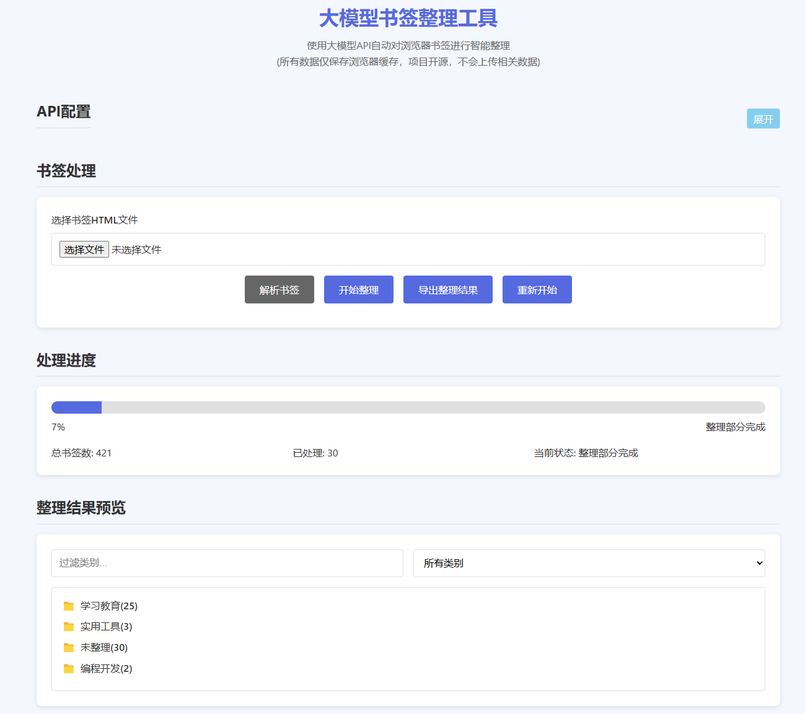

# 大模型书签整理工具  
> Bookmark Zen: AI-Powered Bookmark Organizer 

## 项目简介 

Bookmark Zen 是一个基于人工智能的浏览器书签分类整理工具，旨在帮助用户快速高效地对书签进行分类管理。通过调用大型语言模型API，该工具能够自动分析书签的标题和URL，为每个书签分配适当的类别，并生成结构化的书签文件，便于导入回浏览器。

## 主要特性 

- **智能分类**：利用大型语言模型自动识别并分类书签 
- **类别一致性**：在分类过程中保持类别的连贯性和一致性
- **本地存储**：所有配置和中间结果都保存在浏览器本地存储中
- **断点续传**：支持分批处理，可随时暂停和恢复分类任务 
- **自定义配置**：支持自定义API密钥、API端点、模型名称和提示词
- **直观界面**：提供清晰的处理进度和分类结果预览 
- **导入导出**：支持从浏览器导入书签文件，并导出整理后的结果

## 效果展示

## 如何使用 

1. 在线使用网址：https://we-worker.github.io/bookmark-Zen
   
2. **配置API**：
   - 输入您的API密钥
   - 设置API端点URL
   - 选择使用的模型
   - 自定义分类提示词（可选）

3. **导入书签**：
   - 点击"选择文件"按钮上传书签HTML文件
   - 点击"解析书签"进行初步解析

4. **分类书签**：
   - 点击"整理书签"开始AI分类
   - 实时查看处理进度和当前状态

5. **查看和导出结果**：
   - 在结果预览区浏览分类结果
   - 使用类别筛选功能快速找到特定类别
   - 点击"导出书签"生成可导入浏览器的HTML文件

## 技术特点 

- **纯前端实现**：完全在浏览器中运行，无需后端服务器 
- **模块化设计**：代码结构清晰，便于维护和扩展 
- **容错机制**：对API响应进行多方式解析，增强稳定性
- **持久化存储**：利用localStorage保存所有状态和中间结果 
- **响应式UI**：提供良好的用户体验和操作反馈

## 支持的API和模型 

支持多种大模型API，包括但不限于：
- OpenAI API（GPT系列模型）
- 通义千问
- 阿里云灵积模型服务
- 百度文心一言
- Claude API
（需要自己输入api地址，摸🐟了）

## 隐私保障 

所有数据都在本地处理，书签内容不会储存在任何外部服务器（除了调用AI服务的必要API请求外）。API密钥和配置信息只保存在您的浏览器本地存储中。

## 开源许可 

本项目采用 [MIT License](https://opensource.org/licenses/MIT) 协议开源。

---

通过Bookmark Zen，让AI为您整理杂乱的书签，找回浏览的乐趣！